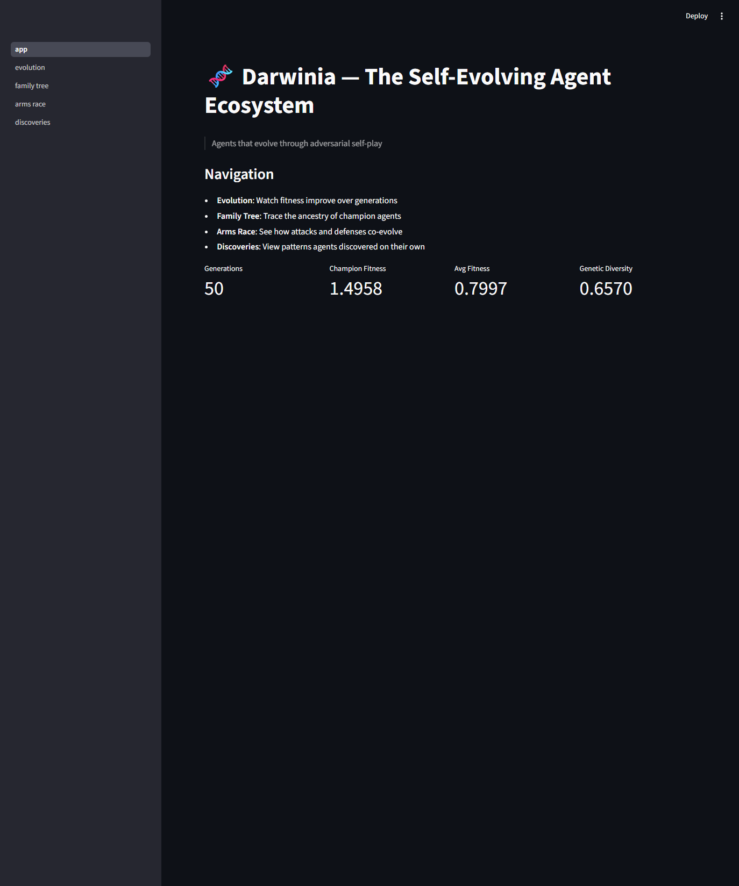
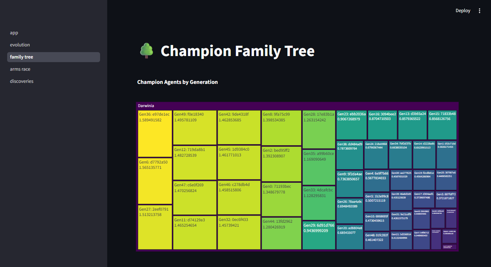
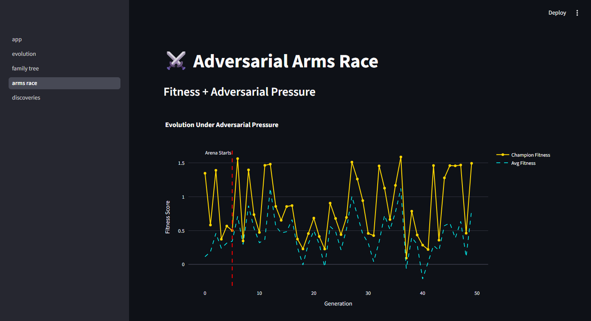
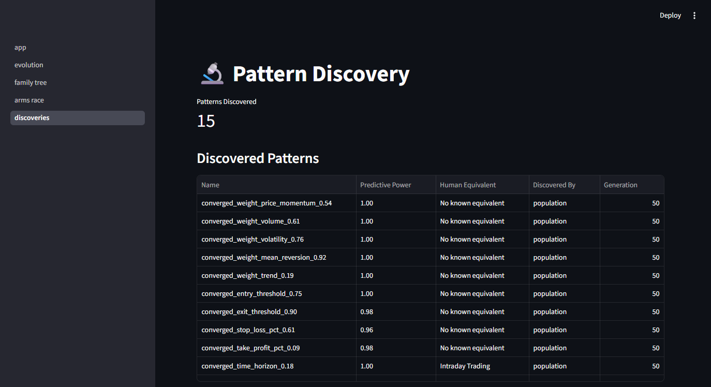

<p align="center">
  <h1 align="center">🧬 Darwinia</h1>
  <p align="center"><strong>Give your AI agent the power to evolve its own trading strategies.</strong></p>
  <p align="center">Trading agents that discover strategies through Darwinian selection and adversarial self-play — not human-written rules.</p>
</p>

<p align="center">
  <a href="https://github.com/0xSanei/darwinia/actions"></a>
  <a href="https://github.com/0xSanei/darwinia/blob/main/LICENSE"></a>
  
  <a href="docs/OPENCLAW.md"></a>
  <a href="https://claude.ai"></a>
  
  
  
</p>

---

## For OpenClaw / Claude Code agents

```
Tell your agent:

"Install Darwinia and evolve a BTC trading strategy."
```

Darwinia ships as an [OpenClaw skill](.openclaw/SKILL.md) and [Claude Code skill](.claude/SKILL.md). Your agent can install it, run evolution, and report results — all through natural language.

<details>
<summary>Manual skill installation</summary>

**OpenClaw:**
```bash
mkdir -p ~/.openclaw/skills/darwinia
cp .openclaw/SKILL.md ~/.openclaw/skills/darwinia/SKILL.md
```

**Claude Code:** Auto-detected from `.claude/SKILL.md` in project root.

</details>

---

## The problem

You hand-code `RSI > 70 = sell`. Market regime changes. Strategy dies. You tweak parameters manually. Repeat forever.

## The Darwinia approach

50 agents with random DNA compete on real BTC data. The weak die. The strong breed. After 50 generations, survivors handle rug pulls, fake breakouts, and whipsaws — not because you told them to, but because **agents that couldn't handle these attacks didn't survive to reproduce**.

```
Before:  Human writes rules → Agent executes → Market changes → Strategy dies
After:   Human sets environment → Agents evolve → Survivors adapt → Patterns emerge
```

---

## Quick Start

```bash
git clone https://github.com/0xSanei/darwinia.git
cd darwinia
pip install -e ".[dev]"

# Evolve trading strategies (30 seconds)
python -m darwinia evolve -g 10

# Test champion against adversarial attacks
python -m darwinia arena

# Launch interactive dashboard
python -m darwinia dashboard
```

No API keys. No cloud. Just Python + numpy. BTC data included.

<details>
<summary><strong>Demo Output</strong> (click to expand)</summary>

**Evolution run:**
```
🧬 Darwinia — Evolution Engine
   Generations: 20 | Population: 30 | Data: BTC/USDT 1h (10,946 candles)

   Gen   0 | ██████░░░░░░░░░░░░░░ | champ=0.32 avg=0.04 div=1.56
   Gen   1 | █████████████░░░░░░░ | champ=0.69 avg=0.24 div=1.60
   Gen   2 | ███████████████████████████ | champ=1.35 avg=0.64 div=1.32
   Gen   5 | █████████████████████████████ | champ=1.46 avg=0.43 div=0.81
   Gen  12 | █████████████████████ | champ=1.09 avg=0.82 div=0.72
   Gen  13 | ████████████████████████ | champ=1.24 avg=0.64 div=0.57
   Gen  19 | ████████░░░░░░░░░░░░ | champ=0.42 avg=0.12 div=0.44

✅ Evolution complete! 16 patterns discovered.
```

**Adversarial arena test:**
```
⚔️ Darwinia — Adversarial Arena
   Testing evolved champion against targeted attacks...

   whipsaw              | PnL: +0.00% | ✅ survived
   fake_breakout        | PnL: +0.00% | ✅ survived
   pump_and_dump        | PnL: +0.00% | ✅ survived
   rug_pull             | PnL: -3.21% | ✅ survived
   slow_bleed           | PnL: -1.05% | ✅ survived

   Survival rate: 100.0%
```
</details>

---

## How It Works

```
   Genesis Pool          Adversarial Arena         Pattern Discovery
   ┌──────────┐         ┌───────────────┐         ┌────────────────┐
   │ 50 agents │───────▶│ Alpha agent   │───────▶│ Analyze WHY     │
   │ with random│        │    vs         │        │ survivors won   │
   │ DNA + seeds│        │ Adversary     │        │                 │
   └──────────┘         │ (6 attacks)   │        │ → Discover new  │
                        └───────┬───────┘        │   market patterns│
                                │                └────────┬────────┘
                    ┌───────────▼───────────┐             │
                    │   NATURAL SELECTION    │◀────────────┘
                    │                       │
                    │ Top 20% survive       │
                    │ Crossover + Mutation   │
                    │ → Next Generation     │
                    └───────────────────────┘
```

Each generation: **Compete** → **Survive attacks** → **Select** → **Breed** → **Mutate** → **Discover**

### 17-Gene DNA

Every trading decision lives in a genome:

| Category | Genes | Controls |
|----------|-------|----------|
| **Signal** | 5 | What matters — momentum, volume, volatility, mean reversion, trend |
| **Threshold** | 4 | When to act — entry/exit triggers, stop loss, take profit |
| **Personality** | 5 | How to behave — risk appetite, time horizon, contrarian bias, patience, sizing |
| **Adaptation** | 3 | How to learn — regime sensitivity, memory length, noise filtering |

### Adversarial Arena

Most bots are tested against history. Darwinia agents are tested against an **adversary trying to destroy them**.

| Attack | What It Does | Who It Traps |
|--------|-------------|-------------|
| Rug Pull | Steady rise → sudden 90% crash | Trend followers without stops |
| Fake Breakout | Breaks resistance → immediate reversal | Breakout traders |
| Slow Bleed | Gradual decline + misleading bounces | Patient agents with loose stops |
| Whipsaw | Rapid alternating moves | Tight-stop agents |
| Volume Mirage | Volume spike, no follow-through | Volume-dependent strategies |
| Pump & Dump | Rapid pump → rapid dump | Momentum chasers |

The adversary **reads the agent's DNA** and picks attacks targeting its weaknesses. Over generations, this creates an arms race.

### Pattern Discovery

After each generation, Darwinia finds **what survivors agree on**:

- **Gene convergence**: All survivors evolved high noise filtering? That's a pattern.
- **Linked genes**: High risk appetite always paired with short time horizon? That's a combo.
- **Human mapping**: Evolved "high contrarian_bias" = mean reversion strategy.
- **Novel patterns**: Gene combos with no known human equivalent = new discovery.

---

## Results

50-generation evolution on 10,946 BTC/USDT 1h candles:

| Metric | Gen 0 | Gen 50 |
|--------|-------|--------|
| Champion Fitness | ~0.15 | ~0.75+ |
| Attack Survival | ~30% | 98-100% |
| Strategy Species | 1 (random) | 3-4 distinct |
| Patterns Found | 0 | 10-20 |

---

## Agent Integration

All commands support `--json` for machine-readable output:

```bash
python -m darwinia evolve -g 50 --json
```

```json
{
  "champion": {
    "id": "a3f2c1d8",
    "fitness": 1.35,
    "genes": {"weight_trend": 0.87, "stop_loss_pct": 0.04, "risk_appetite": 0.35}
  },
  "evolution_summary": {
    "generations_run": 50,
    "patterns_discovered": 16
  }
}
```

| Platform | Integration |
|----------|-------------|
| **OpenClaw** | `.openclaw/SKILL.md` — [integration guide](docs/OPENCLAW.md) |
| **Claude Code** | `.claude/SKILL.md` — auto-detected in project |
| **Any CLI agent** | `python -m darwinia evolve --json` |

---

## CLI Reference

```bash
python -m darwinia evolve -g 100 -p 80        # 100 gens, 80 agents
python -m darwinia evolve -d my_data.csv       # Custom data
python -m darwinia evolve --json               # JSON output for agents
python -m darwinia arena -c output/champions/champion_gen_0049.json
python -m darwinia arena -r 10 --json          # 10 rounds, JSON output
python -m darwinia dashboard                   # Web UI
python -m darwinia info --json                 # System info as JSON
```

## Dashboard

Four interactive views built with Streamlit:

| Evolution | Family Tree |
|:---------:|:-----------:|
|  |  |
| Fitness metrics + population stats | Champion ancestry treemap |

| Arms Race | Discoveries |
|:---------:|:-----------:|
|  |  |
| Fitness under adversarial pressure | Emergent patterns table |

---

## Architecture

```
darwinia/
├── core/          # DNA, agent, market environment
├── evolution/     # Population, fitness, selection, breeding
├── arena/         # Adversarial attacks and combat
├── discovery/     # Pattern analysis and naming
├── chronicle/     # History recording and species tracking
├── personality/   # Personality profiling + market regime detection
└── __main__.py    # CLI entry point

dashboard/         # Streamlit visualization (4 pages)
scripts/           # Competitor monitoring, utilities
```

### Three Layers

| Layer | Status | What It Does |
|-------|--------|-------------|
| **Evolution Engine** | ✅ Implemented | Genetic algorithm + adversarial arena + pattern discovery |
| **Personality Engine** | ✅ Implemented | Quantified trading personalities + market regime detection |
| **Knowledge Protocol** | 🔮 Designed | Agents trade discovered patterns with each other |

---

## Beyond Trading

The evolution engine is **domain-agnostic**. The DNA → Fitness → Selection → Breed cycle works for any agent behavior that can be scored. This release targets crypto trading, but the framework applies to portfolio optimization, risk tuning, resource allocation, game strategy — any domain where you can define a fitness function.

---

## Development

```bash
make setup       # Install dependencies
make test        # Run 22 tests
make evolve      # Run 50 generations
make arena       # Adversarial arena
make dashboard   # Streamlit dashboard
```

## Design Philosophy

Traditional quant: human designs strategy from theory.
Darwinia: human designs the **environment**. Agents discover the strategy.

Your role shifts from **strategy author** to **environment designer** — define the data, the fitness function, the attacks. Let evolution find the rest.

## License

MIT
